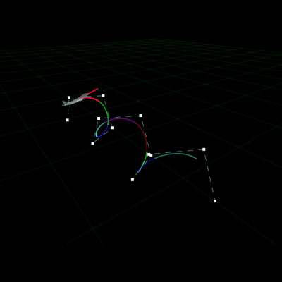
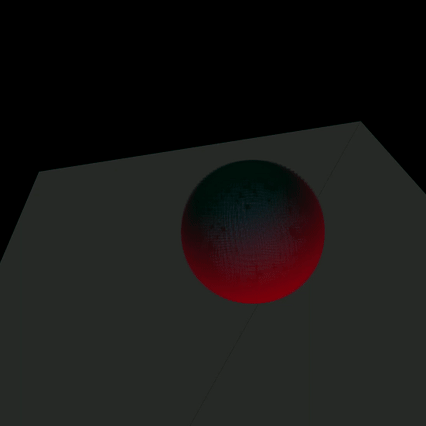

## Računalna animacija FER 2023./2024. Lovro Grgić
Opće upute za pokretanje i kompajlanje su u dokumentaciji. 
Sve su laboratorijske vježbe izvedene u istom projektu. Za odabir laboratorijske vježbe kod kompajlanja, potrebno je promijeniti vrijednost varijable
```cpp
constexpr int LAB = 3;
```
u izvornoj datoteci `main.cpp` na jednu od vrijednosti 1, 2, ili 3.

U git grani `main` vrijedi `LAB=3`. Zbog jednostavnosti stvorene su git grane za prve dvije laboratorijske vježbe, [lab1](https://github.com/mikota/racani/tree/lab1) i [lab2](https://github.com/mikota/racani/tree/lab2).
